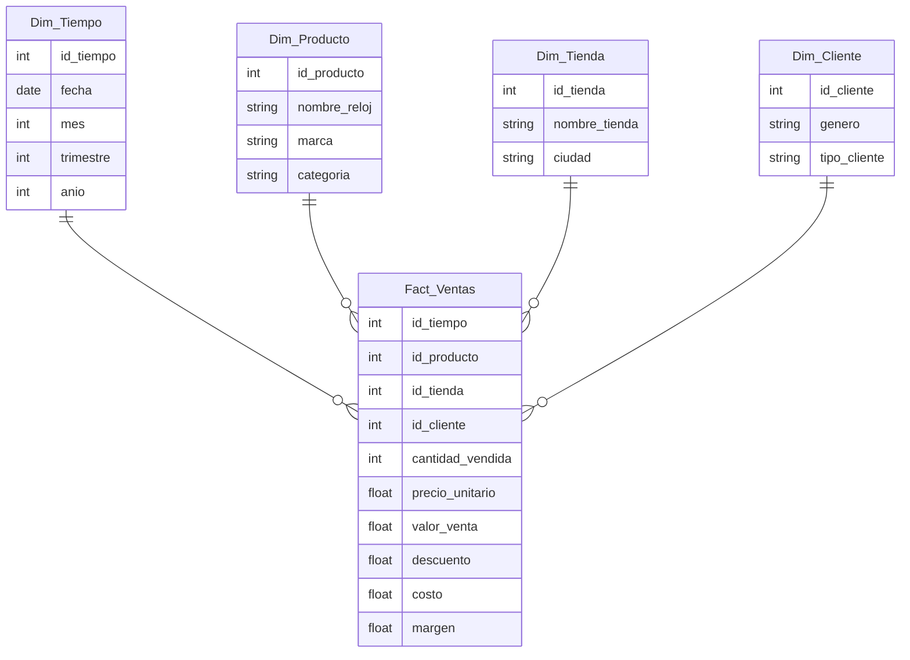

# Modelo Estrella — Relojería "Tempus"

## 1. Pregunta de negocio y KPI

**Pregunta de negocio:** ¿Cuáles son las ventas mensuales por tienda y por marca de reloj, y qué línea de producto genera mayor margen de ganancia?

**KPI:** Ingresos totales por ventas mensuales.
**Meta:** Incrementar los ingresos mensuales en un 8% respecto al mes anterior, y mantener un margen de ganancia mínimo del 30% por venta.

## 2. OLTP vs OLAP

El sistema de origen es el **punto de venta (POS)** de las tiendas, que registra cada transacción individual (venta, cliente, producto, hora). Este es un sistema **OLTP** (Online Transaction Processing), optimizado para registrar muchas transacciones pequeñas de forma rápida y confiable, no para hacer análisis.

El análisis debe hacerse en un entorno **OLAP / data warehouse** porque:
- Las consultas analíticas (sumar ventas por mes, comparar tiendas, agrupar por marca) requieren leer y agregar millones de registros históricos, lo cual es lento y costoso en un sistema transaccional.
- Ejecutar estas consultas directamente sobre el POS afectaría el rendimiento de las ventas en tiempo real.
- El warehouse permite consolidar datos históricos de varias tiendas y estructurarlos para consultas rápidas de negocio (reportes, tableros, KPIs).

## 3. Modelo Estrella

**Tabla de hechos: `Fact_Ventas`**

| Medida | Descripción |
|---|---|
| cantidad_vendida | Unidades vendidas |
| precio_unitario | Precio de venta por unidad |
| valor_venta | Total de la línea de venta |
| descuento | Valor descontado |
| costo | Costo del producto |
| margen | valor_venta − costo |

**Dimensiones**

**Dim_Tiempo**: id_tiempo, fecha, día, mes, trimestre, año, día_semana

**Dim_Producto**: id_producto, nombre_reloj, marca, categoría (deportivo, clásico, lujo), material_correa

**Dim_Tienda**: id_tienda, nombre_tienda, ciudad, región

**Dim_Cliente**: id_cliente, nombre, género, rango_edad, tipo_cliente (nuevo/recurrente)

## 4. Diagrama de estrella

**Preguntas que el modelo puede responder:**
1. ¿Cuál fue el total de ventas por marca de reloj en cada trimestre de 2025?
2. ¿Qué tienda tuvo el mayor margen de ganancia en ventas de relojes de lujo durante el último mes?

---

## Model & questions (English)

The fact table `Fact_Ventas` stores one row per sold item, linked to the Time, Product, Store, and Customer dimensions. Its measures are quantity sold, unit price, total sale value, discount, cost, and margin, which together allow the business to track revenue and profitability at different levels of detail. Because each row is tied to a specific date, watch brand, store, and customer type, the fact table can be aggregated in many ways without touching the operational point-of-sale system. This model can answer: (1) What was the total revenue by watch brand in each quarter of 2025? and (2) Which store had the highest profit margin on luxury watch sales last month? Answering these questions supports the store's monthly revenue KPI and helps managers decide where to focus marketing and inventory efforts.
